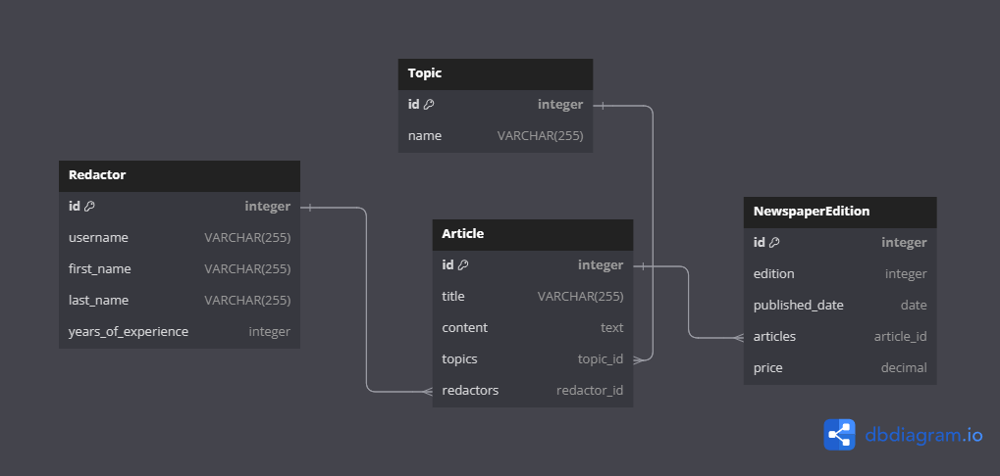
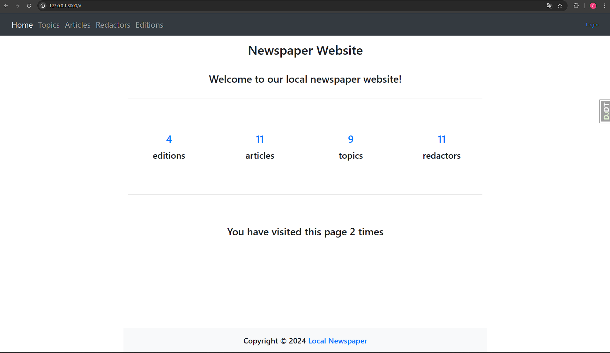
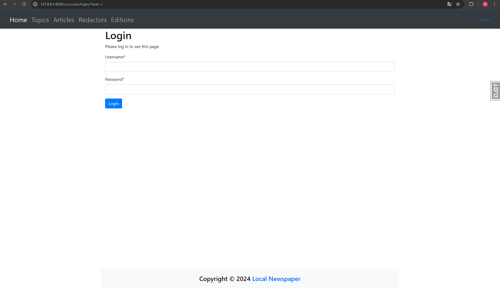
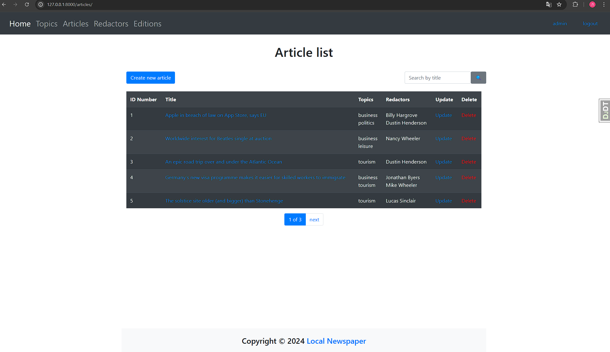
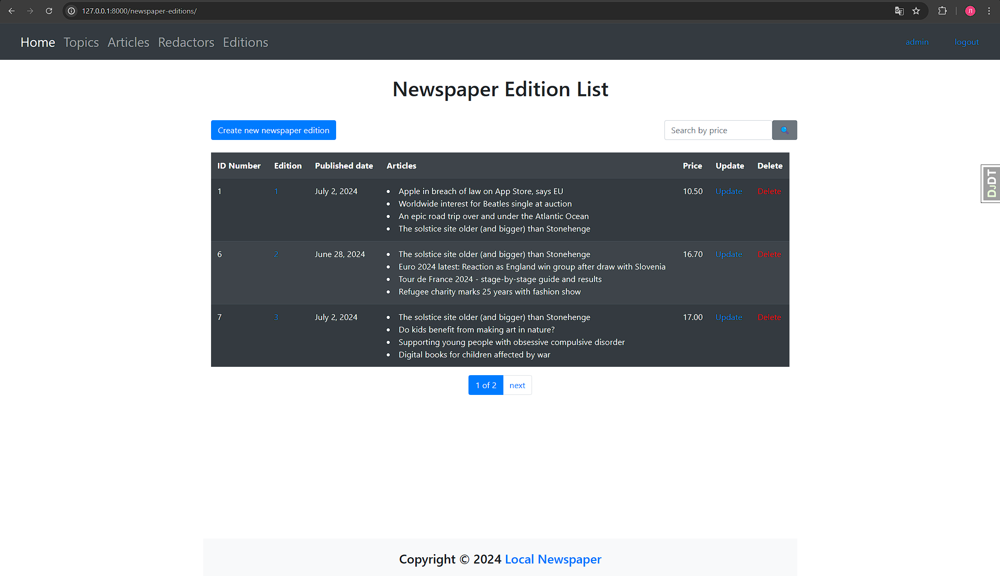
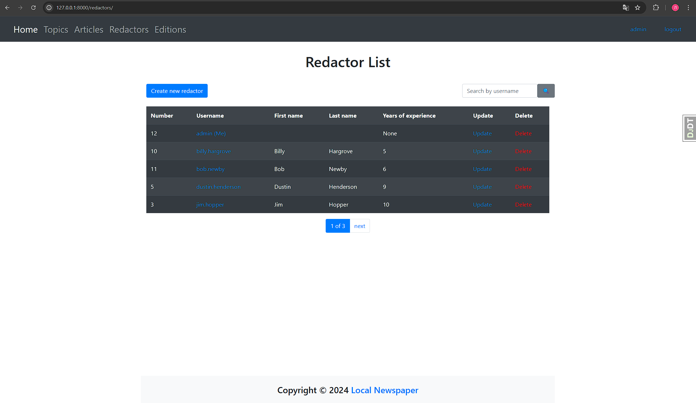
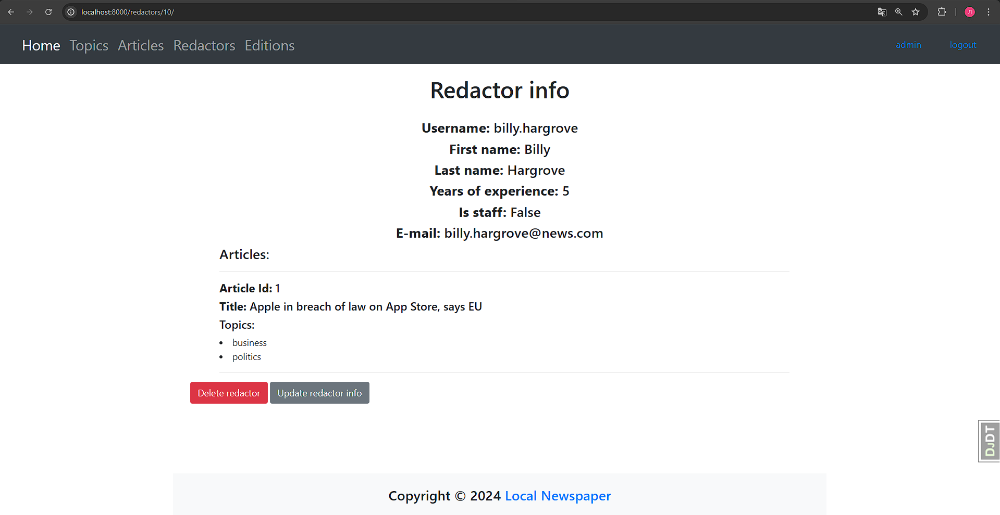

# **Local Newspaper Agency**

## Project Overview

This project simulates the basic structure of Newspaper with NewspaperEdition, Article, Redactor and Topic models


Link to DB Structure diagram: https://dbdiagram.io/d/668573b79939893daef5a8ed



## **Features**

Redactor is a user who can log in on its account on newspaper site, fill in its basic info (username, email, first and last name, years of experience in field).
Each redactor can create and publish an Article on certain Topic. Articles can be grouped into NewspaperEditions.


## Access and Authentication

Access to all pages, except the main page, requires user authentication.
A search functionality is provided for:
* Redactors (by username),
* Topics (by name),
* Articles(by title),
* NewspaperEditions(by price).

## Additional Features

Pagination is implemented on all pages to improve navigation and usability. Comprehensive tests have been written for both custom and core project features to ensure reliability.


Use the following credentials to test the application:

**Login:** admin Password: News!Qazcde3

## Installation

```shell

* git clone https://github.com/lmidzhak/py-local-newspaper-agency.git
* python3 -m venv venv (mac) 
* python -m venv venv (win)
* source venv/bin/activate (mac)
* venv\Scripts\activate(win)
* pip install -r requirements.txt
* python manage.py runserver
```

# Here is a link to the project on Render: 
### **https://py-local-newspaper-agency.onrender.com/**
login: user
password: user12345

## Project pages Demo







